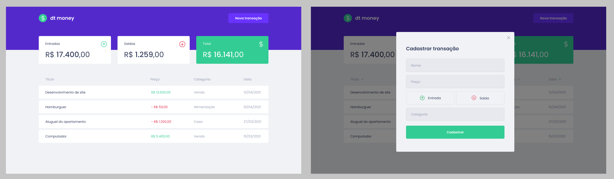

<h1 align="center">
  Go Finances
</h1>

<h6>
Aplicação desenvolvida em React, que faz o cadastro de despesas/ganhos e listagem das finanças em uma dashboar.
</h6>

## :rocket: Como executar

<ul>
  <li>Clonar o projeto</li>
  <li>Instalar as depêndencias usando <strong>yarn</strong></li>
  <li>Executar projeto com o comando <strong>yarn start</strong></li>
</ul>

## :speech_balloon: Funcionalidades

<ul>
  <li>Cadastro de despesas/ganhos</li>
  <li>Listagem das items cadastrados</li>
  <li>Cálculo das entradas, despesas e valor total</li>
</ul>

## ⌨️ Tecnologias

<ul>
  <li>React</li>
  <li>TypeScript</li>
  <li>Context</li>
  <li>MirageJs (Fake API)</li>
  <li>Polished</li>
  <li>Styled Components</li>
  <li>React Modal</li>
</ul>
